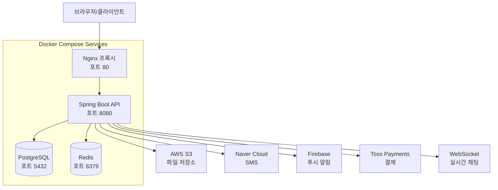

# DevBlind - 개발자 소개팅 서비스 백엔드

> **블라인드 방식의 개발자 전용 소개팅 플랫폼**  
> 기술 스택과 취향을 기반으로 한 스마트 매칭 시스템

[](https://spring.io/projects/spring-boot)
[](https://openjdk.java.net/)
[](https://www.postgresql.org/)
[](https://redis.io/)
[](https://www.docker.com/)
[](https://nginx.org/)
[](http://localhost/swagger-ui/index.html)

## 목차

- [프로젝트 개요](#프로젝트-개요)
- [주요 기능](#주요-기능)
- [아키텍처](#아키텍처)
- [로컬 개발 환경](#로컬-개발-환경)
- [API 문서](#api-문서)
- [기술 스택](#기술-스택)
- [프로젝트 구조](#프로젝트-구조)
- [보안](#보안)
- [모니터링](#모니터링)
- [배포](#배포)
- [문제 해결](#문제-해결)

## 프로젝트 개요

**DevBlind**는 개발자들을 위한 특별한 소개팅 플랫폼입니다. 기존의 외모 중심 매칭과 달리, **기술 스택**, **취향**, **가치관**을 기반으로 한 **스마트 매칭 알고리즘**을 제공합니다.

### 핵심 가치
- **내면 중심 매칭**: 외모가 아닌 실력과 성향으로 매칭
- **개발자 특화**: 기술 스택, 코딩 스타일 등 개발자만의 매칭 요소
- **프라이버시 보호**: 철저한 개인정보 보호 및 블라인드 시스템
- **실시간 소통**: WebSocket 기반 실시간 채팅

## 주요 기능

### **인증 시스템**
- **SMS 인증**: Naver Cloud Platform 연동
- **JWT 토큰**: Access/Refresh Token 기반 보안
- **Spring Security**: 엔터프라이즈급 보안 설정

### **스마트 매칭**
- **점수 기반 추천**: 기술 스택, 위치, 나이, 취향 종합 분석
- **가중치 알고리즘**: 각 요소별 가중치를 적용한 매칭 점수 계산
- **Pull Request 시스템**: 특별한 관심 표현 방식

### **실시간 채팅**
- **WebSocket**: 실시간 메시지 송수신
- **매칭 연동**: 매칭 성공 시 자동 채팅방 생성
- **읽음 상태**: 읽지 않은 메시지 카운트

### **결제 시스템**
- **Toss Payments**: 안전한 결제 연동
- **코인 시스템**: 추가 추천 기능 구매
- **환불 처리**: 완전한 환불 프로세스

### **알림 시스템**
- **FCM**: Firebase Cloud Messaging 연동
- **실시간 알림**: 매칭, 메시지, 좋아요 알림

### **파일 관리**
- **AWS S3**: 프로필 이미지 업로드
- **파일 검증**: 형식 및 크기 검증

## 아키텍처

### **현재 아키텍처 (Docker Compose)**



### **서비스 구성**
- **Nginx**: 리버스 프록시, 로드 밸런싱, 정적 파일 서빙
- **Spring Boot**: REST API 서버, 비즈니스 로직 처리
- **PostgreSQL**: 메인 데이터베이스, 사용자/매칭/채팅 데이터
- **Redis**: 세션 저장소, 캐시, 실시간 데이터

### **네트워크 구성**
- **devblind-network**: Docker 브리지 네트워크
- **포트 매핑**: 호스트 포트 → 컨테이너 포트
- **서비스 간 통신**: 컨테이너 이름으로 직접 통신

## 로컬 개발 환경

### **사전 요구사항**
- **Docker**: 28.3.2 이상
- **Docker Compose**: 2.0 이상
- **Java**: 24 (컨테이너 내부에서 사용)
- **메모리**: 최소 4GB RAM

### **빠른 시작**

#### **1. 프로젝트 클론**
```bash
git clone <repository-url>
cd devblind-backend
```

#### **2. 환경 변수 설정 (선택사항)**
```bash
# .env 파일 생성 (필요시)
cp .env.example .env
# 환경 변수 수정
```

#### **3. Docker Compose로 실행**
```bash
# 모든 서비스 시작
docker-compose up -d

# 로그 확인
docker-compose logs -f

# 특정 서비스 로그 확인
docker-compose logs -f app
```

#### **4. 접속 테스트**
- **메인 앱**: http://localhost
- **Spring Boot 직접**: http://localhost:8080
- **Swagger UI**: http://localhost/swagger-ui/index.html
- **API 문서**: http://localhost/v3/api-docs

### **개발 환경 설정**

#### **환경별 프로파일**
```bash
# 로컬 개발 환경
SPRING_PROFILES_ACTIVE=local

# 개발 서버 환경
SPRING_PROFILES_ACTIVE=dev

# 운영 서버 환경
SPRING_PROFILES_ACTIVE=prod
```

#### **데이터베이스 연결**
```yaml
# application-local.yml
spring:
  datasource:
    url: jdbc:postgresql://postgres:5432/devblind_local_db
    username: root
    password: root
  data:
    redis:
      host: redis
      port: 6379
```

### **개발 워크플로우**

#### **코드 변경 후 재시작**
```bash
# 1. 컨테이너 중지
docker-compose down

# 2. 이미지 재빌드 (코드 변경사항 반영)
docker-compose build --no-cache app

# 3. 컨테이너 재시작
docker-compose up -d

# 또는 한 번에 실행
docker-compose up -d --build
```

#### **Hot Reload (개발 중)**
```bash
# 개발 모드로 실행 (코드 변경 시 자동 재시작)
docker-compose -f docker-compose.dev.yml up
```

### **유용한 Docker 명령어**
```bash
# 서비스 상태 확인
docker-compose ps

# 특정 서비스 재시작
docker-compose restart app

# 로그 확인
docker-compose logs -f [service-name]

# 컨테이너 내부 접속
docker-compose exec app bash
docker-compose exec postgres psql -U root -d devblind_local_db

# 볼륨 및 네트워크 정리
docker-compose down -v
docker system prune -f
```

## API 문서

### **Swagger UI**
- **Nginx 프록시**: http://localhost/swagger-ui/index.html
- **직접 접근**: http://localhost:8080/swagger-ui/index.html

### **API 문서**
- **OpenAPI 3.0**: http://localhost/v3/api-docs
- **JSON 형식**: http://localhost/v3/api-docs.json

### **주요 엔드포인트**

#### 인증
```http
POST /auth/sms/send          # SMS 인증 코드 발송
POST /auth/sms/verify        # 인증 코드 검증
POST /auth/sms/signup        # 회원가입
POST /auth/sms/token/refresh # 토큰 갱신
POST /auth/sms/logout        # 로그아웃
```

#### 사용자
```http
GET  /users/me               # 내 프로필 조회
PUT  /users/me               # 프로필 수정
DELETE /users/me             # 회원 탈퇴
GET  /users/check-nickname   # 닉네임 중복 확인
POST /users/device-token     # 디바이스 토큰 등록
DELETE /users/device-token   # 디바이스 토큰 삭제
GET  /tech-stacks           # 기술 스택 목록 조회
GET  /user-balance          # 사용자 잔액 조회
```

#### 파일 업로드
```http
POST /api/files/profile-image # 프로필 이미지 업로드
```

#### 매칭
```http
GET  /matching/recommendations # 추천 매칭 목록
GET  /matching/additional-recommendations # 추가 추천 목록 (유료)
GET  /matching/score/{targetUserId} # 매칭 점수 계산
POST /matching/like           # 좋아요/싫어요
GET  /matching/received-likes # 받은 좋아요 목록
POST /matching/respond-like/{senderUserId} # 받은 좋아요에 응답
GET  /matching/my-matchings   # 내 매칭 목록
POST /matching/start-chat/{matchingId} # 채팅 시작
POST /matching/profile        # 매칭 프로필 생성/수정
```

#### 채팅
```http
GET  /chat/rooms              # 채팅방 목록
GET  /chat/rooms/{matchingId}/messages # 메시지 목록
POST /chat/rooms/{matchingId}/messages # 메시지 전송
GET  /chat/rooms/{matchingId}/unread-count # 읽지 않은 메시지 수
```

#### 결제
```http
GET  /payment-products       # 결제 상품 목록
POST /payments               # 결제 요청
GET  /payment-histories      # 결제 내역 조회
POST /refunds               # 환불 요청
GET  /refund-histories      # 환불 내역 조회
```

## 기술 스택

### **백엔드 핵심**
- **Spring Boot 3.5.4**: 최신 안정 버전
- **Java 24**: 최신 버전 (Preview)
- **Spring Security 6**: JWT 기반 인증
- **Spring Data JPA**: ORM 및 데이터 접근
- **Spring WebFlux**: 반응형 프로그래밍 지원

### **데이터베이스**
- **PostgreSQL 15**: 메인 데이터베이스
- **Redis 7**: 세션 저장소 및 캐시
- **H2**: 테스트용 인메모리 DB

### **인프라 및 도구**
- **Docker 28.3.2**: 컨테이너화
- **Docker Compose**: 멀티 서비스 오케스트레이션
- **Nginx**: 리버스 프록시, 로드 밸런싱
- **Gradle 8**: 빌드 도구

### **개발 도구**
- **Lombok**: 보일러플레이트 코드 제거
- **Springdoc OpenAPI**: API 문서화
- **JUnit 5**: 테스트 프레임워크

### **외부 서비스**
- **AWS S3**: 파일 저장소
- **Naver Cloud Platform**: SMS 발송
- **Firebase FCM**: 푸시 알림
- **Toss Payments**: 결제 처리

### **모니터링**
- **Spring Boot Actuator**: 헬스체크 및 메트릭
- **Logback**: 구조화된 로깅
- **Micrometer**: 메트릭 수집

## 프로젝트 구조

```
devblind-backend/
├── src/main/java/com/yongjincompany/devblind/
│   ├── auth/                           # 인증 관련
│   │   ├── config/                    # 인증 설정
│   │   ├── controller/                # 인증 API
│   │   ├── dto/                       # 인증 DTO
│   │   └── service/                   # 인증 비즈니스 로직
│   ├── user/                          # 사용자 관리
│   │   ├── controller/                # 사용자 API
│   │   ├── dto/                       # 사용자 DTO
│   │   ├── entity/                    # 사용자 엔티티
│   │   ├── repository/                # 사용자 레포지토리
│   │   └── service/                   # 사용자 비즈니스 로직
│   ├── matching/                      # 매칭 시스템
│   │   ├── controller/                # 매칭 API
│   │   ├── dto/                       # 매칭 DTO
│   │   ├── entity/                    # 매칭 엔티티
│   │   ├── repository/                # 매칭 레포지토리
│   │   └── service/                   # 매칭 알고리즘
│   ├── chat/                          # 채팅 시스템
│   │   ├── controller/                # 채팅 API
│   │   ├── dto/                       # 채팅 DTO
│   │   ├── entity/                    # 채팅 엔티티
│   │   ├── repository/                # 채팅 레포지토리
│   │   └── service/                   # 채팅 비즈니스 로직
│   ├── payment/                       # 결제 시스템
│   │   ├── controller/                # 결제 API
│   │   ├── dto/                       # 결제 DTO
│   │   ├── entity/                    # 결제 엔티티
│   │   ├── repository/                # 결제 레포지토리
│   │   └── service/                   # 결제 비즈니스 로직
│   ├── file/                          # 파일 관리
│   │   ├── controller/                # 파일 업로드 API
│   │   ├── dto/                       # 파일 DTO
│   │   └── service/                   # S3 연동 서비스
│   └── common/                        # 공통 모듈
│       ├── config/                    # 설정 클래스
│       ├── controller/                # 홈 컨트롤러
│       ├── dto/                       # 공통 DTO
│       ├── exception/                 # 예외 처리
│       ├── security/                  # 보안 설정
│       └── util/                      # 유틸리티
├── src/main/resources/
│   ├── application.yml                # 공통 설정
│   ├── application-local.yml          # 로컬 환경 설정
│   ├── application-dev.yml            # 개발 환경 설정
│   ├── application-prod.yml           # 운영 환경 설정
│   ├── data.sql                       # 초기 데이터
│   └── logback-spring.xml            # 로깅 설정
├── nginx/
│   ├── nginx.conf                     # Nginx 설정
│   └── logs/                          # Nginx 로그
├── docker-compose.yml                 # Docker Compose 설정
├── Dockerfile                         # Spring Boot 컨테이너 설정
├── build.gradle.kts                   # Gradle 빌드 설정
└── README.md                          # 프로젝트 문서
```

### **아키텍처 패턴**
- **레이어드 아키텍처**: 각 계층의 명확한 책임 분리
- **도메인 주도 설계**: 비즈니스 로직 중심 설계
- **의존성 주입**: Spring IoC 컨테이너 활용
- **Repository 패턴**: 데이터 접근 계층 추상화

## 보안

### **인증 및 인가**
- **JWT (JSON Web Token)**: Stateless 인증
- **Access/Refresh Token**: 토큰 갱신 메커니즘
- **Spring Security**: 엔터프라이즈급 보안 프레임워크
- **SMS 인증**: 2단계 인증으로 보안 강화

### **데이터 보호**
- **비밀번호 암호화**: BCrypt 해싱
- **개인정보 마스킹**: 로그에서 민감정보 제거
- **CORS 설정**: 클라이언트 도메인 제한

### **보안 모니터링**
- **접근 로그**: 모든 API 접근 기록
- **실패 로그**: 인증 실패 시도 기록
- **이상 탐지**: 비정상적인 접근 패턴 감지

## 모니터링

### **헬스체크**
```bash
# 애플리케이션 상태 확인
curl http://localhost/actuator/health

# Spring Boot 직접 접근
curl http://localhost:8080/actuator/health

# 상세 정보 (인증 필요)
curl -H "Authorization: Bearer YOUR_TOKEN" \
     http://localhost/actuator/health
```

### **사용 가능한 메트릭**
- **/actuator/health**: 애플리케이션 상태
- **/actuator/info**: 애플리케이션 정보
- **/actuator/metrics**: 성능 메트릭

### **로깅**
```yaml
# logback-spring.xml에서 설정
로그 레벨:
  - ERROR: 에러 상황만
  - WARN: 경고 + 에러
  - INFO: 정보 + 경고 + 에러 (기본)
  - DEBUG: 디버그 정보 포함
```

### **주요 모니터링 포인트**
- **API 응답 시간**: 평균 200ms 이하 유지
- **데이터베이스 연결**: Connection Pool 상태
- **Redis 연결**: 캐시 히트율
- **외부 API**: SMS, 결제, S3 연동 상태

### **Docker 로그 모니터링**
```bash
# 실시간 로그 확인
docker-compose logs -f

# 특정 서비스 로그
docker-compose logs -f app
docker-compose logs -f nginx
docker-compose logs -f postgres

# 로그 필터링
docker-compose logs app | grep "ERROR"
```

## 배포

### **Docker 배포 (현재)**

#### **로컬 개발 환경**
```bash
# 모든 서비스 시작
docker-compose up -d

# 특정 서비스만 시작
docker-compose up -d postgres redis
docker-compose up -d app
docker-compose up -d nginx
```

#### **프로덕션 환경**
```bash
# 프로덕션 프로파일로 실행
SPRING_PROFILES_ACTIVE=prod docker-compose up -d

# 백그라운드 실행
docker-compose -f docker-compose.prod.yml up -d
```

### **클라우드 배포**

#### **AWS 배포**
```bash
# AWS Elastic Beanstalk
./gradlew build
eb init
eb deploy
```

#### **Heroku 배포**
```bash
# Heroku CLI
./gradlew build
heroku create your-app-name
git push heroku main
```

### **운영 환경 설정**
```bash
# 운영 환경 변수
export SPRING_PROFILES_ACTIVE=prod
export SERVER_PORT=8080
export JAVA_OPTS="-Xmx2g -Xms1g"

# 애플리케이션 실행
java $JAVA_OPTS -jar devblind-backend.jar
```

## 테스트

### **테스트 실행**
```bash
# 전체 테스트
./gradlew test

# 특정 클래스 테스트
./gradlew test --tests AuthServiceTest

# 코버리지 리포트 생성
./gradlew jacocoTestReport
```

### **테스트 구조**
```
src/test/java/com/yongjincompany/devblind/
├── controller/                    # API 통합 테스트
├── service/                       # 비즈니스 로직 단위 테스트
└── repository/                    # 데이터 접근 테스트
```

### **테스트 커버리지 목표**
- **전체 커버리지**: 80% 이상
- **서비스 계층**: 90% 이상
- **컨트롤러 계층**: 85% 이상

## 문제 해결

### **자주 발생하는 문제들**

#### **1. 포트 충돌**
```bash
# 포트 사용 중인 프로세스 확인
netstat -ano | findstr :80
netstat -ano | findstr :8080

# 프로세스 종료
taskkill /PID <PID> /F
```

#### **2. 컨테이너 시작 실패**
```bash
# 컨테이너 상태 확인
docker-compose ps

# 로그 확인
docker-compose logs [service-name]

# 컨테이너 재시작
docker-compose restart [service-name]
```

#### **3. 데이터베이스 연결 실패**
```bash
# PostgreSQL 컨테이너 상태 확인
docker-compose exec postgres psql -U root -d devblind_local_db

# Redis 연결 테스트
docker-compose exec redis redis-cli ping
```

#### **4. Nginx 프록시 문제**
```bash
# Nginx 설정 문법 검증
docker-compose exec nginx nginx -t

# Nginx 재시작
docker-compose restart nginx
```

#### **5. Spring Boot 앱 문제**
```bash
# 애플리케이션 로그 확인
docker-compose logs -f app

# 컨테이너 내부 접속
docker-compose exec app bash

# JAR 파일 확인
docker-compose exec app ls -la /app/
```

### **디버깅 팁**

#### **로그 레벨 조정**
```yaml
# application-local.yml
logging:
  level:
    com.yongjincompany.devblind: DEBUG
    org.springframework.security: DEBUG
    org.hibernate.SQL: DEBUG
```

#### **데이터베이스 스키마 확인**
```bash
# PostgreSQL 스키마 확인
docker-compose exec postgres psql -U root -d devblind_local_db -c "\dt"

# 테이블 구조 확인
docker-compose exec postgres psql -U root -d devblind_local_db -c "\d users"
```

#### **Redis 데이터 확인**
```bash
# Redis 키 목록 확인
docker-compose exec redis redis-cli keys "*"

# 특정 키 값 확인
docker-compose exec redis redis-cli get "key_name"
```

## 개발자

**Backend Developer**: 이용진

## 프로젝트 소개

DevBlind는 개발자들을 위한 특별한 소개팅 플랫폼입니다.  
외모가 아닌 실력과 성향으로 만나는 새로운 방식의 매칭 서비스를 구현했습니다.

### **주요 특징**
- **Docker 기반**: 일관된 개발 환경
- **Nginx 프록시**: 로드 밸런싱 및 보안
- **PostgreSQL + Redis**: 고성능 데이터 저장
- **JWT 인증**: 안전한 사용자 인증
- **실시간 채팅**: WebSocket 기반 통신

<div align="center">

**DevBlind - 개발자를 위한 블라인드 소개팅 플랫폼**

Made with ❤️ by 이용진

[](https://www.docker.com/)
[](https://nginx.org/)
[](https://www.postgresql.org/)
[](https://redis.io/)

</div>
